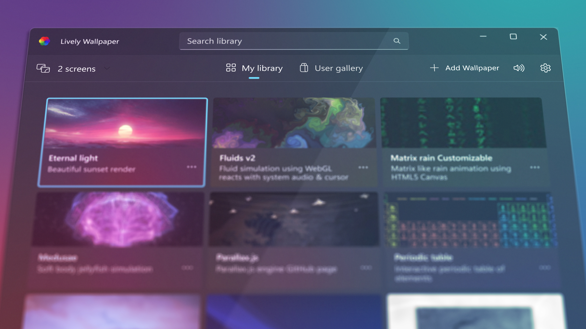

  
  <h2 align="center">Lively Wallpaper</h2>

## Contents
- [About](#about)
- [Features](#features)
- [Download](#download)
- [Support](#support)
- [License](#license)

## About

Animated desktop wallpapers, bring your desktop to life!

#### Join Discussions:
* <a href="https://www.reddit.com/r/LivelyWallpaper/">Reddit</a>
* <a href="https://github.com/rocksdanister/lively/discussions/">Github</a>

## Features
*Wait a sec, preview gif clips take some time to load.*
#### Types Of Wallpapers
| Wallpaper | Example |  Interactive | Resolution | Performance |
|--|--|--|--|--|
| Video/GIF |  <a href="https://www.pexels.com/video/blue-texture-abstract-leaves-7710243/">Video</a> by Rostislav Uzunov | No| Fixed | Fixed |
| Webpage |  <a href="http://louie.co.nz/25th_hour/"> 25th Hour</a> by Loius Coyle  | Yes| Variable | Variable |
| Application/Games |  Run Unity or Godot games as wallpaper | Yes | Variable | Variable |
#### Screensavers

* Lively supports Windows screensaver.
* Any wallpaper can be used as screensaver.
* Multiple monitor supported.
* [Learn more..](https://github.com/rocksdanister/lively/wiki/Screen-Saver)
#### Automation

* Lively can be controlled with command line arguments from terminal.
* Integrate with other languages like Python or scripting software AutoHotKey.
* [Learn more..](https://github.com/rocksdanister/lively/wiki/Command-Line-Controls)
#### Lively API

* Powerful set of API for developers to create interactive wallpapers.
* Get hardware readings, audio graph, music information..
* [Learn more..](https://github.com/rocksdanister/lively/wiki/API)
#### Machine Learning

* Leverage Machine Learning inference to create dynamic wallpapers.
* [Learn more..](https://github.com/rocksdanister/lively/wiki/Machine-Learning)
#### More Features
- Minimal webpage renderer powered by chromium.
- Hardware accelerated video playback using mpv/vlc player with customizable video filters.
- Easy to use; Just drag'n'drop media or webpages into lively to set as wallpaper.
- Latest Windows 11 design using WinUI 3 + WindowsAppSDK framework.
- Efficient, Lively is native application designed for Windows.
- Fully opensource & free; no blackmagic, no features behind paywall.
- Shadertoy.com urls are supported as wallpaper.
#### Performance
 * Wallpaper playback pauses when fullscreen application/games run on the machine (~0% cpu, gpu usage). 
 * Set wallpaper playback rules based on running foreground application.
 * Can be set to pause wallpaper when running on battery power (laptops.)
 * Wallpaper automatically pauses when running remote desktop session.

**_Lively is not officially affiliated with Unity technologies, godot, shadertoy;_**
## Download
##### Microsoft Store (Windows 10 1809 or above)

##### [Installer (Windows 10 1903 or above)](https://github.com/rocksdanister/lively/releases/latest)

Installer may give Smartscreen warning, [discussion.](https://github.com/rocksdanister/lively/issues/9)

[Which version do I download?](https://github.com/rocksdanister/lively/wiki/Differences-Between-Distributions)

## Support
Are you a Lively fan and want to help out? here are some options..

#### Programmer
Code contributions are welcome, [learn more..](https://github.com/rocksdanister/lively/wiki/Contributing-Guidelines)

#### Designer
Help improve UI/UX of Lively, [learn more..](https://github.com/rocksdanister/lively/wiki/Contributing-Guidelines)

#### Localization
Help translate Lively to more languages, [learn more..](https://github.com/rocksdanister/lively-translations)

#### Suggestions & Bug report
Suggest new features or file bug reports to improve Lively, [learn more..](https://github.com/rocksdanister/lively/issues)

#### Patreon
Financially support Lively by become a patreon member and get your name listed in-app, [learn more..](https://patreon.com/rocksdanister)

#### Spread the word
Star this repository, leave a Microsoft store review or tell your friend.. any help is welcome :)

## License
Lively is licensed under [GPL-v3.](https://github.com/rocksdanister/lively/blob/core-separation/LICENSE)
